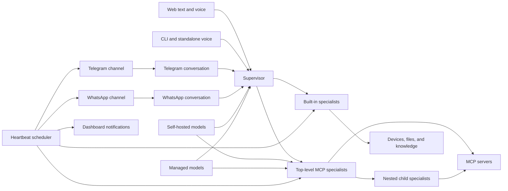

# Mounir

### A universal AI agent platform for any model, tool, channel, or environment

> **One assistant. Any compatible model. Any MCP toolchain. Every interaction channel.**

Mounir is not a fixed chatbot with a hard-coded list of actions. It is a universal,
runtime-configurable AI platform that turns models, tools, services, and interfaces
into one coordinated team of specialists. A supervisor understands the request,
delegates it to the right agent, lets that agent use real tools, and returns one
clear answer.

What makes Mounir different is that its capabilities can evolve while it is
running. Connect an MCP server, choose a model, create a specialist, and the new
capability becomes available on the next message—without changing Python code or
restarting the application.

Deploy Mounir for one person, a team, or an entire organization. It can become an
executive assistant, an engineering copilot, a research system, an operations
console, a customer-service agent, or a company-wide automation platform. Its
environment and domain are defined by the models, knowledge, channels, and MCP
servers connected to it—not by assumptions built into its core.

---

## Why Mounir is different

- **Dynamic by design** — models, MCP servers, subagents, tools, icons, prompts,
  permissions, and schedules are managed from the interface and stored in SQLite.
- **A real multi-agent system** — a supervisor delegates work to focused agents
  instead of exposing every tool to one overloaded model.
- **Infrastructure-independent** — connect self-hosted models, managed cloud
  providers, on-device services, remote APIs, or any combination of them.
- **MCP-native extensibility** — connect local stdio servers, modern remote
  Streamable HTTP servers, and legacy SSE servers.
- **More than chat** — reach the same agent platform through text, browser voice,
  standalone voice, the CLI, Telegram, WhatsApp, and future channels.
- **Proactive when needed** — Heartbeat runs safe scheduled checks and delivers
  meaningful notifications to the dashboard and selected messaging channels.
- **Human control remains explicit** — risky tools can require confirmation,
  dynamic agents can be disabled instantly, and background checks only receive
  tools approved for unattended use.
- **Built for inspection** — Agent Studio makes the active models, specialists,
  channels, MCP connections, tools, and status visible as one live system.

---

## What it can do

Mounir ships with a useful core and becomes broader as capabilities are attached.

| Area | Capabilities |
|---|---|
| Conversation | Streaming text chat, persistent history, CLI, web, Telegram, and WhatsApp |
| Voice | Browser speech input, standalone push-to-talk, wake word mode, STT, and TTS |
| Desktop | Volume, brightness, media, Wi-Fi, Bluetooth, power, browser, and approved shell actions |
| Files and media | Read and create documents, spreadsheets, images, audio, video, and presentations |
| Knowledge | Recall and maintain durable memory through Mounir's built-in local GBrain service |
| MCP | Discover tools from connected servers and turn them into dynamic specialists |
| Models | Manage local and cloud model profiles, providers, endpoints, and credentials |
| Automation | Scheduled Heartbeat checks with safe tool selection and duplicate suppression |
| Notifications | Persistent in-app Heartbeat feed plus selectable Telegram and WhatsApp delivery |
| Administration | Visual agent graph, connection health, tool catalog, activation controls, and profile settings |

Through MCP, the same system can be extended for source control, email, browsers,
databases, documentation, calendars, messaging, monitoring, CRM, internal APIs,
and other domains without adding those integrations to Mounir's core.

---

## The system at a glance



Each agent receives a compact schema only for its direct children. Mounir chooses
a top-level specialist; that specialist can delegate further down its own team and
return one final report upward. Raw MCP calls and intermediate output stay inside
the relevant specialist, keeping every parent context smaller and easier to reason
about.

The graph is rebuilt from the database before every turn. Adding, editing,
activating, deactivating, moving, or deleting a dynamic subagent changes the
runtime hierarchy immediately.

### Backend agent architecture

The execution layer uses LangGraph v1 primitives directly:

- `MessagesState` and the built-in message reducer keep tool calls and results
  paired in canonical LangChain messages.
- Python tools use `@tool` or `StructuredTool`; JSON schemas are inferred from
  type annotations instead of being maintained by hand.
- `ToolNode` validates arguments, executes tool batches, converts failures into
  tool results, and powers both built-in and dynamic MCP specialist loops.
- Conditional graph edges enforce tool-round limits, declined-action handling,
  and supervisor-to-specialist routing.
- LangGraph custom streams carry provider tokens directly to every interface;
  there is no separate queue/thread streaming bridge in the agent runtime.

Provider adapters remain isolated in `mounir/llm.py`, so the same graph works
with Ollama, Mistral, Groq, NVIDIA, Gemini, and OpenAI-compatible endpoints.

---

## Dynamic MCP specialists

Mounir acts as an **MCP client and host**: it consumes tools published by MCP
servers and presents them to specialized agents. Mounir itself is not currently
an MCP server.

The model, MCP server, and dynamic subagent registries intentionally start empty
on every new installation. Mounir never inserts provider-specific dynamic presets;
users create and connect only the resources that match their own environment.

### The no-code workflow

1. Create or select a model in **Agent Studio → Models**.
2. Add an MCP server in **Agent Studio → MCP Servers**.
3. Test the connection once. Mounir discovers and stores the server's tools.
4. Create a subagent with a name, purpose, instructions, model, server, icon, and
   parent. Choose Mounir for a top-level agent or another subagent for a child.
5. Activate it. Its direct parent can delegate to it on the next message.

When editing an existing subagent, the **Child subagents** list can assign or move
multiple specialists to that parent in one save. Parent and child controls update
the same validated hierarchy.

The user never needs to write a function schema or manually append tools to a
prompt. Mounir reads the MCP server's tool definitions, caches their names and
descriptions, creates the specialist capability presented to the supervisor, and
routes calls through the correct MCP connection.

### Supported MCP connections

| Transport | Best for | What the user enters |
|---|---|---|
| **stdio** | Local MCP packages and command-line servers | Command, arguments, and optional environment values |
| **Streamable HTTP** | Modern hosted or network MCP servers | MCP endpoint URL and authentication |
| **SSE** | Older remote MCP servers | SSE endpoint URL and authentication |

Remote authentication is presented as four understandable choices:

- **No authentication**
- **OAuth** — discover the MCP authorization servers, use Authorization Code +
  PKCE, and retain refreshable credentials privately
- **API key** — send the key as a Bearer token or in a named API header
- **Advanced headers** — add custom headers required by the server

Local server credentials are environment values passed to the child process by
Mounir. They are entered and stored through the interface; the user does not need
to maintain shell `export` commands. A local connection may also store private
credential files, map each file path to a user-chosen environment variable, and
define an optional one-time setup command. Mounir runs only the exact command the
user saves and explicitly starts; it never infers setup behavior from a package
name, provider, or command.

The saved server page separates one-time setup from connection testing. OAuth
opens the authorization page discovered through the MCP standard. Local setup
commands run with the same configured environment and credential-file paths that
the MCP server receives. A successful connection test then discovers and caches
the server's tools before it is linked to a subagent.

### Tool discovery and permissions

Successful connection tests persist the discovered tool catalog in SQLite. Opening
a server later shows the cached tools immediately instead of reconnecting every
time. Each tool is displayed with a readable name and description.

From the discovered list, the user can choose which actions require confirmation.
Only approval-free tools can be selected for Heartbeat. Exact duplicate action
prevention can also be enabled per subagent to stop an agent from submitting the
same tool request twice during one task.

If the user declines an MCP action, that tool is not called and the dynamic agent
stops without another model request. The cancellation propagates through every
nested parent agent to the supervisor, which returns a deterministic notice rather
than asking a model to reinterpret the refusal. Approved actions completed before
the refusal are reported honestly; later actions are skipped.

Dynamic MCP calls have two independent limits:

- **Tool timeout:** 60 seconds by default for one MCP tool call
- **Agent timeout:** 300 seconds by default for the complete delegated task

Both values can be changed with `MOUNIR_MCP_TOOL_TIMEOUT` and
`MOUNIR_MCP_AGENT_TIMEOUT`.

---

## Built-in specialists

Mounir includes focused specialists that work even before custom MCP agents are
added. Each specialist has a readable capability page, an activation control, and
a selectable saved model in Agent Studio. Its Security page lets the user choose
whether every action, selected actions, or no actions require approval; those
rules are stored per built-in specialist and enforced before a tool executes.

### Files and Media

Replaces the supervisor's direct file tools with six focused operations: read,
create, and edit files; load and generate media; and find local artifacts. Path
discovery uses configured XDG folders, case-insensitive traversal, and bounded
fuzzy search instead of assuming literal English folder paths. It supports PDFs,
spreadsheets, Word documents, text data, images, audio, sampled-and-transcribed
video, and PowerPoint presentations. Image generation uses a separately selected
OpenAI-compatible image model or Mistral's built-in image-generation tool; video
generation remains adapter-dependent.

### Knowledge

Uses a required local GBrain MCP server. Mounir creates the managed server entry
automatically, binds Knowledge to it, installs and initializes GBrain when
needed, and discovers its live tool schemas at startup. Its PGLite data is
isolated under Mounir's data directory, so unrelated global GBrain settings do
not affect Knowledge. The managed connection cannot be replaced, edited, or
deleted.

Mounir exposes a focused subset of GBrain's native page and recall tools rather
than inventing tools before connection. Page writes, deletion, and restoration
require action confirmation by default. Knowledge exposes no tools until the
real local server connects and advertises the required native interface. Memory
is consulted only when the supervisor delegates a knowledge task—it is not
injected into every conversation turn. The former repository `knowledge/`
directory remains untouched so its content can be migrated manually.

Semantic search is optional and disabled on a fresh installation. Embedding
connections are configured separately under **Models → Embeddings** using either
the OpenAI-compatible embedding API or Ollama. The model catalog can be discovered
from the configured service, and a connection test records the vector dimensions
returned by the selected model. Knowledge only accepts tested models. Enabling or
changing one uses GBrain's supported migration command to index existing memories;
disabling it keeps memory storage and text-based search available without making
embedding requests.

### System

Controls supported desktop functions such as audio, display brightness, media,
Wi-Fi, Bluetooth, power actions, browser actions, and approved commands.

Inactive specialists are removed from runtime delegation—not merely hidden in the
UI. The workflow keeps them visible as muted nodes with a red relationship so the
configured architecture remains understandable.

---

## Models without infrastructure lock-in

Mounir does not force one model vendor across the entire system. The supervisor,
built-in specialists, and dynamic MCP agents can use different models for different
jobs.

| Runtime area | Supported configuration |
|---|---|
| Supervisor | Saved OpenAI-compatible local or cloud models |
| Dynamic MCP specialists | OpenAI-compatible chat-completions endpoints with tool calling |
| Files/Media and System | Configurable OpenAI-compatible provider/model profiles, initially NVIDIA-oriented |
| Knowledge | Configurable Gemini/OpenAI-compatible profile |
| Speech to text | Faster Whisper-compatible local models in CTranslate2 format, or provider-neutral OpenAI-compatible transcription APIs |
| Text to speech | Local Piper, local MOSS-TTS-Nano ONNX, provider-neutral OpenAI-compatible speech APIs, or Google Cloud TTS |

An OpenAI-compatible endpoint can be local or remote. Ollama-compatible endpoints,
LocalAI, vLLM, cloud gateways, and vendor endpoints can work for dynamic agents when
they implement the required chat-completions and function-calling behavior.

The architecture adapts to different infrastructure strategies:

- **Self-hosted deployment** — operate models, speech, MCP services, and data on
  infrastructure controlled by the user or organization.
- **Managed deployment** — use hosted LLM, speech, and MCP services for rapid
  scaling and access from multiple environments.
- **Hybrid deployment** — place every model and capability where it fits best,
  keeping sensitive systems controlled while using managed services selectively.

Provider labels help organize model records; the endpoint and API behavior determine
actual compatibility.

---

## Every way to use Mounir

### Web dashboard

The dashboard keeps the conversation at the center of the experience:

- **Left:** voice orb, speech controls, and entry to Agent Studio
- **Center:** full-height multimodal conversation and composer
- **Right:** persistent Heartbeat notifications and live activity

Messages stream over WebSocket, conversation history survives refreshes, and tool
approval requests appear in the same interface that initiated the action. The image
button accepts JPEG, PNG, and WebP uploads. Uploaded images are stored privately as
opaque conversation attachments and sent directly to a vision-capable supervisor;
their pixels remain available to follow-up turns while the originating message is in
the bounded conversation context. Image paths typed as text remain Files and Media
operations and are not treated as uploads.

### Voice

The web interface accepts recorded speech and can speak responses. A separate voice
entry point supports push-to-talk and hands-free wake word operation.

Supported voice backends:

- STT: local **Faster Whisper**, which accepts Whisper models in compatible
  **CTranslate2 format**, or any hosted/self-hosted service implementing the
  OpenAI-compatible `POST /audio/transcriptions` contract (including Groq)
- TTS: local **Piper**, multilingual **MOSS-TTS-Nano ONNX**, any hosted/self-hosted
  service implementing the OpenAI-compatible `POST /audio/speech` contract, or
  native **Google Cloud TTS**

Local STT does not load arbitrary speech or audio model families. It supports only
models that Faster Whisper can load. A recognized model name uses Faster Whisper's
standard model download and cache behavior. A model stored elsewhere must be provided
as a full directory path and must already be converted to the compatible CTranslate2
format. Other local STT engines can be connected only when they expose the supported
OpenAI-compatible transcription API.

Voice configuration—including model, voice, language, endpoint, and credential—is
managed from **Agent Studio → Voice**. Voice-originated turns also receive an explicit
instruction to answer naturally for speech, without Markdown-heavy formatting.
Compatible connections accept either an API root such as `https://provider.example/v1`
or the complete operation endpoint. Bearer API keys are optional, which allows local
speech servers with no authentication. The model and voice fields are sent unchanged,
so the available choices come from the connected service rather than a hard-coded
provider allowlist.

### Telegram

`server.py` can run the web app, Heartbeat, and Telegram bot together. Telegram is
configured from **Agent Studio → Telegram**:

1. Paste a BotFather token.
2. Test the connection.
3. Generate a temporary one-use pairing code.
4. Send `/pair <code>` to the bot.

Mounir stores the paired account automatically; no numeric chat ID is required in
the form. Tokens are never returned by the admin API. Invalid or revoked tokens stop
polling cleanly and show an actionable error instead of producing an endless retry
traceback.

Telegram replies default to text. The saved reply mode can be changed from Agent
Studio or with `/vocal` and `/text`; it applies independently of whether the request
was typed or recorded. `/status`, `/reset`, and `/help` are also registered in
Telegram's command menu. Voice replies use the configured text-to-speech provider
and fall back to text if speech generation is unavailable.

Incoming photos and image documents become multimodal conversation attachments, so
the supervisor can inspect their pixels directly and retain them for follow-up turns.
Videos, video notes, animations, and ordinary documents are downloaded to Mounir's
private Telegram attachment directory and passed to Files and Media with their exact
local path and optional caption. The Telegram directory and download ceiling can be
customized with `MOUNIR_TELEGRAM_ATTACHMENT_DIR` and
`MOUNIR_TELEGRAM_MAX_ATTACHMENT_BYTES`; direct chat images use the shared chat
attachment settings below.

Web and Telegram maintain **separate conversation histories**. Tool execution is
serialized across both channels so simultaneous requests cannot race while acting
on shared tools, accounts, services, or devices. Confirmations return to their
originating channel.

`python telegram_cli.py` remains available when Telegram needs to run without the
web server. Do not run both long-poll consumers for the same bot at once.

### Meta social apps

Facebook, Messenger, Instagram, Threads, and WhatsApp are grouped under
**Agent Studio → Meta**, with a separate, consistent tab for each app. Facebook,
Messenger, Instagram, and Threads use a shared multi-account OAuth foundation but
remain separate connections and built-in agents. OAuth connects accounts; the
first-party LangGraph tools call the official APIs; MCP is optional.

The Meta WhatsApp tab is the business-inbox agent integration. It is independent
from the paired WhatsApp chat channel under Connections.

The implementation deliberately excludes Facebook Groups, personal Facebook and
Instagram accounts, scraping, browser/password automation, and cold automated DMs.
See the [Meta integration report](docs/meta-social-integration.md) for the exact
supported operations, security boundaries, setup, and primary Meta sources.

### WhatsApp

WhatsApp is a first-class server-managed channel built on Meta's official WhatsApp
Business Cloud API. It has its own **Connections → WhatsApp** entry and no unofficial browser
automation. Incoming messages reach FastAPI through a signed webhook, and replies
are sent through the Graph API.

Configure it from **Agent Studio → Connections → WhatsApp** using the values from the Meta App
Dashboard:

1. Add the phone number ID, WhatsApp Business Account ID, permanent access token,
   and Meta app secret.
2. Save and test the connection. Mounir validates the phone and subscribes the app
   to the Business Account.
3. Copy the generated callback URL and verify token into Meta's webhook settings.
4. Enable WhatsApp and generate a temporary pairing command.
5. Send that command to the business number from the phone that should be authorized.

The callback must be reachable through public HTTPS. When exposing the server
through a domain or reverse proxy, include that host and origin in Mounir's allowed
web configuration.

Every webhook body is verified with the Meta app secret before it is processed.
Duplicate webhook message IDs are ignored, secrets are never returned by read APIs,
and only the paired phone can submit agent requests. WhatsApp uses its own `Agent`
and conversation history, isolated from both web and Telegram.

WhatsApp permits free-form replies during the 24-hour customer-service window after
an inbound message. For proactive Heartbeat delivery outside that window, configure
an approved template whose body contains one variable for the alert text.

### Command line

`python cli.py` provides the interactive client. It supports `/reset`, `/save`,
`/load`, and `/exit`.

---

## Heartbeat: proactive, safe automation

Heartbeat Tasks let Mounir watch for several independent changes without waiting
for a question. Every record controls:

- its name, normal-language task prompt, and enabled state
- its independent interval, optional execution limit, remaining runs, next run,
  status, and history; tasks can run continuously, while completing the final
  run of a limited task pauses it automatically
- which specialists Mounir may delegate to
- which approval-free tools each selected specialist may use
- which exact duplicate actions should be suppressed
- whether alerts should also be delivered through Telegram and WhatsApp

Mounir reads each due task as a normal request and decides which of its selected
specialists should handle it. Built-in and dynamic specialists appear in one
capability selector. Selecting an agent initially selects its safe tools, and the
user can narrow that allowlist. Tools requiring confirmation remain visible but
muted and cannot be saved for unattended execution.

Heartbeat applies the restriction in the UI, database validation, scoped Mounir
graph, and specialist runtime. Quiet runs stay quiet; meaningful changes create a
persisted notification labeled with its originating task. Web delivery is always
enabled. Telegram and WhatsApp delivery can be selected independently per task,
and each destination is used only when it is enabled, configured, and paired.

---

## Agent Studio

Agent Studio is the control plane for the entire system.

### Live architecture overview

The default view is a zoomable, pannable graph showing:

- the Mounir supervisor
- built-in specialists
- active and inactive dynamic MCP specialists
- the Telegram input channel when enabled
- the WhatsApp input channel when enabled
- model and status summaries

Nodes are clickable. Icons uploaded for dynamic specialists are stored in SQLite and
appear in both the graph and list view. Telegram and WhatsApp are rendered as input
channels, visually distinct from supervisor-to-specialist delegation.

### Configuration areas

| Area | What can be managed |
|---|---|
| Models | Provider, model name, base URL, API key, and local/cloud compatibility |
| MCP Servers | Transport, command or URL, authentication, status, and cached tools |
| Subagents | Identity, parent, icon, instructions, model, MCP server, confirmations, dedupe, and active state |
| Built-in agents | Purpose, capabilities, model, confirmation rules, and active state |
| Supervisor | Model selection, identity, and direct non-delegation tools |
| Voice | STT and TTS providers, models, voices, endpoints, languages, and keys |
| Telegram | Token lifecycle, connection testing, pairing, activation, and status |
| WhatsApp | Private channel credentials, webhook, phone pairing, activation, and status |
| Meta | Separate Facebook, Messenger, Instagram, Threads, and WhatsApp Business agent connections, official OAuth/API capabilities, accounts, and status |
| Heartbeat | Multiple scheduled tasks, prompts, scoped agents/tools, per-task runs, and notifications |
| Profile | User name, assistant name, location, and preferred response language |

Read-only record pages are designed for consultation rather than displaying disabled
form fields, so long descriptions and system prompts remain fully readable.

---

## Safety and trust boundaries

An agent platform that acts on devices, accounts, data, and external services needs
stricter boundaries than an ordinary chatbot. Mounir includes several layers:

- confirmation gates for shell commands, outbound actions, and selected MCP tools
- route-specific confirmation delivery for web, CLI, voice, Telegram, and WhatsApp
- HMAC-SHA256 verification for every incoming WhatsApp webhook
- one-use private pairing for both messaging channels
- a final runtime check before any inactive subagent can be used
- cycle prevention, protected parent deletion, and a four-level nesting limit
- exact-string file edits that require the target content to be read first
- configurable duplicate action prevention
- MCP tool and whole-agent timeouts
- an approval-free allowlist for Heartbeat
- a bounded Heartbeat run log and notification store
- local SQLite permissions restricted to the current operating-system user
- loopback-only web serving by default, plus trusted-host and origin checks
- isolated temporary browser profiles for browser-automation MCP servers

Browser open and close operations use the operating system's default browser adapter
on Linux, Windows, and macOS. Browser automation servers such as Playwright may use
their own isolated browser profile; they do not automatically inherit personal
history, cookies, passwords, or signed-in sessions.

---

## Who it is for

### Individuals

- A daily assistant available through text, voice, Telegram, WhatsApp, and the web
- A personal operator for devices, accounts, files, and connected services
- A research and knowledge companion powered by the user's preferred models
- An automation hub that expands without coding every integration from scratch

### Teams and organizations

- A unified AI front door for approved tools, systems, knowledge, and services
- Role-specific agents for engineering, support, operations, research, sales, and
  organization-specific workflows
- A controlled MCP orchestration layer with visible permissions and connection state
- A flexible deployment across company infrastructure, managed providers, user
  devices, or a deliberate combination of all three

Mounir's core is domain-independent and deployment-independent. Every organization
defines its own platform by connecting the MCP servers, model endpoints, channels,
instructions, permissions, and knowledge sources it trusts.

---

## Quick start

### Requirements

- Python 3.10+
- Ollama for the default local supervisor configuration, or a configured Mistral or
  Groq supervisor profile
- Node.js 20.19+ (or 22.12+) to build the React interface and run Node-based MCP servers
- FFmpeg for browser voice uploads
- Provider credentials only for cloud services you choose to enable

### Install and launch

```bash
git clone <repository-url>
cd jarvis-local-assistant

python3 -m venv .venv
source .venv/bin/activate
pip install -r requirements.txt

# Build the React web interface
cd frontend
npm install
npm run build
cd ..

# Default local supervisor build
ollama create mounir -f modelfiles/mounir.Modelfile

python server.py
```

Open `http://127.0.0.1:8000` for the assistant and use **Agent Studio** to manage
models, MCP servers, specialists, voice, Telegram, Meta, Heartbeat, and profile
settings.

For frontend development, run `npm run dev` from `frontend/` in a second terminal
while the FastAPI server is running. Vite proxies API, image, and WebSocket traffic
to `127.0.0.1:8000`. Production assets are generated in `web-dist/` and served by
FastAPI; generated files and `node_modules/` are intentionally excluded from Git.

To use a different existing Ollama model without creating the custom build:

```bash
MOUNIR_MODEL=qwen3:4b python server.py
```

### Optional voice installation

```bash
# Debian/Ubuntu system audio dependency
sudo apt install portaudio19-dev

pip install -r requirements-voice.txt
python voice_cli.py
python voice_cli.py --wake
```

Piper requires a local `.onnx` voice model and its matching `.onnx.json` file.
Configure their path in Agent Studio or through `MOUNIR_PIPER_MODEL`.
MOSS-TTS-Nano requires the official runtime directory with both ONNX model
repositories under its `models/` directory; select that directory and a built-in
voice preset in Agent Studio. Agent Studio discovers voice presets from the
selected package's manifest, so compatible packages are not limited to a fixed
application-defined voice list.

---

## Important configuration

Runtime defaults live in `mounir/config.py`. Database-backed settings are created or
edited in Agent Studio and take precedence after their initial import.

| Variable | Default | Purpose |
|---|---|---|
| `MOUNIR_MODEL` | `mounir` | Initial local Ollama supervisor model |
| `MOUNIR_MAX_HISTORY` | `20` | Bounded recent-message prompt window |
| `MOUNIR_DATA_DIR` | `~/.mounir` | SQLite database, conversations, and local voice data |
| `MOUNIR_CHAT_ATTACHMENT_DIR` | `<data dir>/chat/attachments` | Persistent images attached through web or messaging conversations |
| `MOUNIR_CHAT_ATTACHMENT_MAX_BYTES` | `10485760` | Maximum size of one directly attached conversation image |
| `MOUNIR_TELEGRAM_ATTACHMENT_DIR` | `<data dir>/telegram/attachments` | Persistent incoming Telegram videos and ordinary files |
| `MOUNIR_TELEGRAM_MAX_ATTACHMENT_BYTES` | `20971520` | Maximum Telegram attachment download size |
| `MOUNIR_MCP_TOOL_TIMEOUT` | `60` | Maximum seconds for one MCP tool call |
| `MOUNIR_MCP_AGENT_TIMEOUT` | `300` | Maximum seconds for one delegated MCP task |
| `MOUNIR_KNOWLEDGE_TOOL_TIMEOUT` | `300` | Maximum seconds for one knowledge MCP verb |
| `MOUNIR_KNOWLEDGE_AGENT_TIMEOUT` | `600` | Maximum seconds for one delegated Knowledge task |
| `MOUNIR_GBRAIN_HOME` | `<MOUNIR_DATA_DIR>/gbrain` | Parent directory for the isolated built-in GBrain instance |
| `MOUNIR_TANK_REGISTRY_URL` | `https://tankpkg.dev/api/v1` | Tank skill registry API; may point to a self-hosted Tank instance |
| `MOUNIR_TANK_SITE_URL` | Registry site root | Public skill-page root used for source links |
| `MOUNIR_TANK_API_TOKEN` | unset | Optional Tank bearer token for private registries or higher read limits |
| `NVIDIA_API_KEY` | unset | Initial Media and System provider credential |
| `GEMINI_API_KEY` | unset | Initial Knowledge provider credential |
| `GROQ_API_KEY` | unset | Optional credential for the compatible `groq` STT bootstrap alias |
| `MOUNIR_STT_BACKEND` | `local` | Initial STT transport: `local` or `openai_compatible` (`groq` remains an alias) |
| `MOUNIR_STT_BASE_URL` | OpenAI API root | Initial compatible transcription API root or full endpoint |
| `MOUNIR_STT_MODEL` | `whisper-1` | Initial compatible transcription model ID |
| `MOUNIR_STT_API_KEY` | unset | Optional initial compatible transcription bearer key |
| `MOUNIR_TTS_BACKEND` | `piper` | Initial TTS transport: `piper`, `openai_compatible`, or `google` |
| `MOUNIR_TTS_BASE_URL` | OpenAI API root | Initial compatible speech API root or full endpoint |
| `MOUNIR_TTS_MODEL` | `tts-1` | Initial compatible speech model ID |
| `MOUNIR_TTS_VOICE` | `alloy` | Initial compatible speech voice ID |
| `MOUNIR_TTS_API_KEY` | unset | Optional initial compatible speech bearer key |
| `MOUNIR_WAKE_WORD` | `hey_jarvis` | openWakeWord trigger for hands-free voice |
| `MOUNIR_WAKE_THRESHOLD` | `0.5` | Wake-word detection threshold |

Telegram environment settings are imported once if present. After initialization,
Agent Studio owns the bot configuration.

---

## Persistence and memory

Mounir stores configuration in `~/.mounir/mounir.db` by default. This includes the
profile, model registry, MCP servers, cached tool metadata, dynamic specialists,
icons, activation state, voice configuration, Telegram and WhatsApp settings,
Heartbeat tasks, per-task agent/tool permissions, runs, and notifications.

Conversation memory preserves complete valid turns, including paired tool calls and
results. A rolling window prevents unbounded prompt growth. Web, Telegram, and
WhatsApp use different `Agent` instances and histories, so switching channels does
not mix unrelated conversations.

---

## Project structure

```text
server.py                 FastAPI web, WebSocket, messaging channels, and Heartbeat runtime
cli.py                    Text REPL
voice_cli.py              Push-to-talk and wake-word voice client
telegram_cli.py           Standalone Telegram runtime
frontend/                 React + TypeScript source for the dashboard and Agent Studio
web-dist/                 Generated production frontend (created by npm run build)
images/                   Interface assets
modelfiles/               Local Ollama model definition

mounir/
  agent.py                Public assistant interface and conversation ownership
  langgraph_agent.py      Supervisor graph and dynamic delegation schema
  builtin_agents.py       Built-in specialist registry and activation logic
  mcp_agents.py           Dynamic MCP connection, discovery, and agent loop
  db.py                   SQLite schema and persistence API
  heartbeat.py            Safe scheduler and change-notification pipeline
  telegram_bridge.py      Pairing and lifecycle-managed Telegram transport
  whatsapp_bridge.py      Signed webhook and official WhatsApp Cloud API transport
  meta_social.py          Official Meta OAuth, account discovery, and Graph API operations
  whatsapp_business.py    Separate WhatsApp Business inbox and agent operations
  llm.py                  Supervisor/provider adapters
  stt.py / tts.py         Speech provider adapters
  voice.py / wakeword.py  Voice session and wake-word behavior
  browser_control.py      Cross-platform default-browser integration
  tools.py                Direct supervisor tools and confirmation boundaries
  specialists/            Built-in and MCP specialist implementations

tests/
  test_dynamic_mcp.py     Dynamic MCP, activation, permissions, and runtime tests
  fixtures/               Deterministic local MCP test server
```

---

## Technical architecture

- **FastAPI** serves the dashboard, Agent Studio, REST configuration APIs, and the
  streaming chat WebSocket.
- **React and TypeScript** provide feature-based dashboard and Agent Studio views;
  TanStack Query owns server state and React Flow renders the live topology.
- **LangGraph** compiles the supervisor and active specialist topology.
- **SQLite** is the local source of truth for runtime configuration and cached MCP
  metadata.
- **MCP** provides an open tool boundary between Mounir and external capabilities.
- **Provider adapters** separate orchestration from model vendors.
- **Application-owned scheduling** runs Heartbeat independently of the page lifecycle.
- **Managed Telegram polling** starts and stops with server configuration.
- **Signed WhatsApp webhooks** run inside the FastAPI server with no second process.

The runtime intentionally separates configuration, orchestration, tool execution,
and presentation. That makes it possible to add another model provider, MCP server,
specialist, or interface without rebuilding the entire assistant.

---

## Current boundaries

Mounir is ambitious, but its current contracts are explicit:

- Dynamic MCP integration consumes **tools**; generic MCP prompts and resources are
  not yet exposed to agents.
- OAuth depends on the remote MCP server publishing standards-compatible protected
  resource and authorization metadata, and supporting dynamic client registration.
- Dynamic models must support OpenAI-compatible chat completions and function/tool
  calling correctly.
- Desktop controls depend on operating-system support. Default-browser opening and
  closing is cross-platform; some system controls remain platform-specific.
- The custom `Hey Mounir` wake-word model is not bundled; supported openWakeWord
  models can be selected today.

These are deliberate boundaries, not hidden assumptions.

---

## For AI agents and contributors

The fastest correct mental model is:

1. `Agent.respond()` is the public turn boundary.
2. The LangGraph supervisor is rebuilt from current database state before a turn.
3. Built-in and top-level dynamic specialists are capability nodes, not raw tool dumps.
4. Every dynamic specialist can expose only its direct children as delegation tools.
5. Dynamic MCP schemas come from cached/discovered server tools and the configured
   subagent purpose.
6. A specialist executes tools privately and returns a compact report to its parent.
7. Confirmation is request-scoped and must return through the originating interface.
8. Each Heartbeat task gives Mounir only its explicitly selected agents and non-interactive tools.
9. Web, Telegram, and WhatsApp conversations are isolated; shared tool execution is
   locked.
10. Deactivation must be enforced in the backend even if a stale frontend or graph
   still references the agent.
11. Secrets may be accepted by configuration endpoints but must never be returned by
    read APIs.
12. User-supplied models and providers must drive their own discoverable options;
    never hard-code a catalog copied from one developer installation. When a provider
    has no discovery standard, accept its identifiers directly and prefer broadly
    adopted compatibility contracts such as OpenAI-compatible APIs.

When changing the project, preserve those invariants. Prefer adding provider or
transport adapters over hard-coding one service into the supervisor. A capability
that can arrive through MCP should remain dynamic and user-configurable.

Run the deterministic test suite with:

```bash
python -m unittest discover -s tests -v
```

---

## Vision

Mounir is designed around a simple idea: an AI agent should not be trapped inside
one interface, one model provider, one infrastructure environment, or one fixed
collection of tools. It should be a universal platform that people and organizations
can shape around their own systems—controlled when trust matters, connected when
reach matters, proactive when timing matters, and always under visible human
governance.

The result is one extensible platform that can power a single assistant, a team of
specialists, or an organization-wide AI workforce without rebuilding the foundation
for every new model, capability, channel, or domain.
